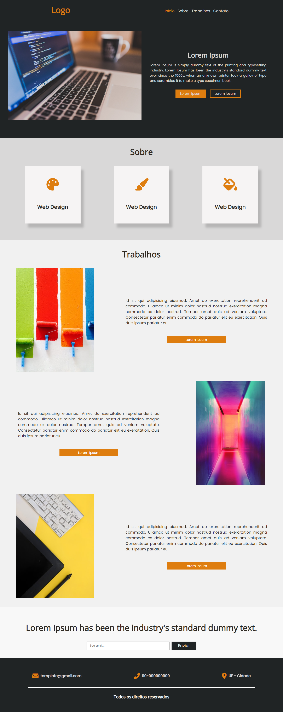

# Landing Page portfolio
 Essa é uma Landing Page para exibir e destacar um portfólio de projetos. A Landing Page foi projetada para fornecer uma visão geral dos trabalhos realizados, habilidades e experiências relevantes. Você encontrará neste repositório o código-fonte, sinta-se à vontade para explorar, colaborar e adaptar esta Landing Page para criar uma apresentação impressionante do seu próprio portfólio.
 


# Recursos
A landing page do portfólio possui os seguintes recursos:

- Design responsivo que se adapta a diferentes tamanhos de tela e dispositivos.
- Menu de navegação que permite aos usuários acessarem facilmente as seções da página.
- Seção de introdução com uma imagem de destaque e texto descritivo.
- Seção "Sobre" que pode destacar os principais serviços ou habilidades.
- Seção de "Trabalhos" que exibe projetos anteriores com imagens e descrições.
- Seção de "Contato" com um formulário de inscrição por e-mail.
- Rodapé com ícones de contato e informações adicionais.

# Tecnologias
As seguintes tecnologias foram utilizadas para desenvolver essa landing page:

- HTML: Linguagem de marcação utilizada para estruturar o conteúdo da página.
- CSS: Linguagem de estilo utilizada para definir a aparência e o layout da página.
- JavaScript: Linguagem de programação utilizada para adicionar interatividade e comportamento à página.
- Font Awesome: Biblioteca de ícones utilizada para exibir ícones na página.
- jQuery: Biblioteca JavaScript utilizada para facilitar a manipulação do DOM e interações com os elementos da página.

# Utilização

Para utilizar essa Landing Page na sua máquina siga os seguintes passos:

- Clone o repositório para sua máquina local utilizando o seguinte comando:
```bash
  git clone https://github.com/ViniciusQuintas/landing-page-portfolio.git
```
- Após clonar o repositório, navegue até o diretório da Landing Page no terminal:
```bash
  cd landing-page-portfolio
```
- Agora, abra o arquivo index.html no seu navegador para visualizar a página em ação.

# Contribuição
Se você deseja contribuir para o desenvolvimento dessa Landing page, siga os seguintes passos:

1️⃣ Faça um fork deste repositório. 
<br>
<br>
2️⃣ Crie uma nova branch para sua contribuição. 
<br>
<br>
3️⃣ Faça suas alterações no código. 
<br>
<br>
4️⃣  Certifique-se de que suas alterações não quebram o funcionamento existente da página. 
<br>
<br>
5️⃣ Faça um pull request com suas alterações. 
<br>
<br>

# Licença
Este projeto está licenciado sob a Licença MIT. Consulte o arquivo LICENSE para obter mais informações.
